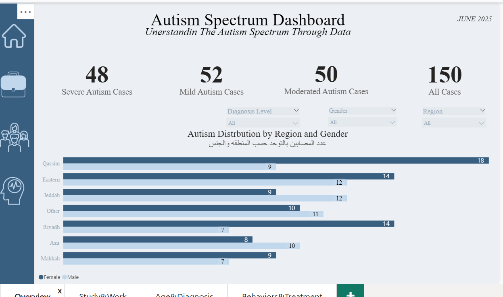
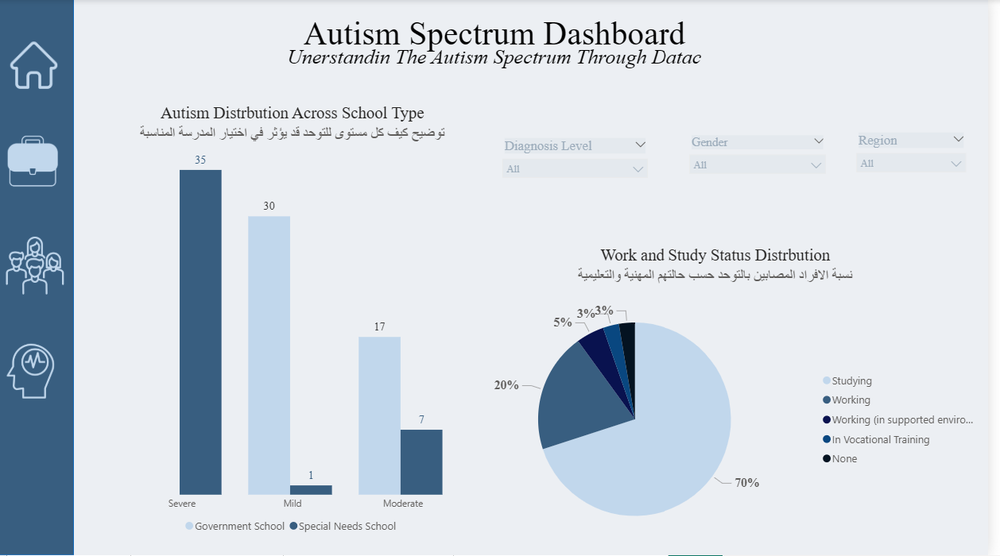
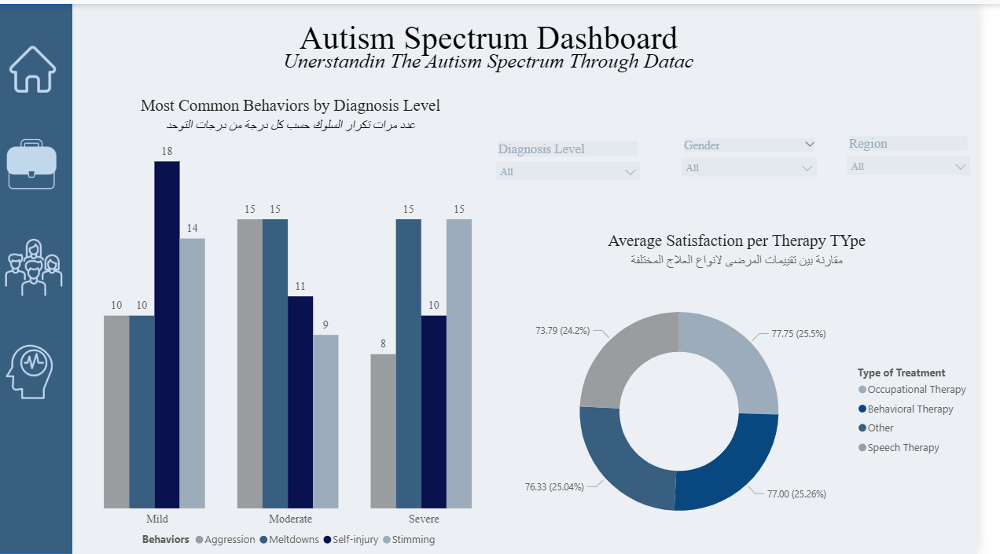
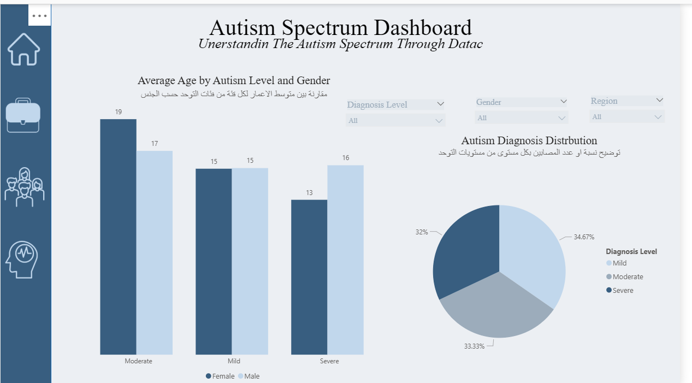

# Autism-Spectrum-Data-A# Comprehensive Autism Spectrum Data Analysis and Insights

## Project Overview
This project delivers an end-to-end descriptive and statistical data analysis focused on individuals on the autism spectrum. Driven by a core analytical question—How do educational, behavioral, and therapeutic experiences differ across varying levels of autism diagnosis?—this study uncovers critical hidden patterns. Notably, it challenges common misconceptions by highlighting that a "Mild" diagnosis does not equal less psychological struggle, as evidenced by specific behavioral trend metrics.

## Key Insights and Findings
* **Demographic Distribution:** The highest density of documented cases resides in the Eastern and Qassim regions, with Mild autism being the most prevalent classification, followed by Moderate and Severe.
* **Educational Tracks:** While Severe cases are predominantly aligned with Special Needs Schools, Mild and Moderate cases are split between Government and Private schooling systems. 
* **The Mild Diagnosis Paradox:** A striking finding revealed that individuals diagnosed with Mild Autism displayed the highest rates of self-injurious behavior. This underscores a critical gap in social awareness and psychological support for those who mask their struggles.
* **Therapy and Satisfaction Metrics:** Speech and Occupational therapies yielded the highest user satisfaction rates compared to other interventions.

## Data Architecture and Workflow
The analysis integrates four interrelated datasets containing 150 unique cases to build a cohesive dashboard tracking behavioral and support outcomes:
1. **Demographics Data:** Tracks Gender, Age, Diagnosis Level, Studying/Working Status, School Type, and Region.
2. **Daily Life Impact:** Measures Independence Levels, schooling environments .
3. **Support and Services:** Analyzes treatment statuses, therapy sessions per month , and satisfaction levels.
4. **Calculated Insights:** Statistically tracks and visualizes key metrics visible in the dashboard, such as the total case count (**150 cases**) and specific diagnosis volumes (**48 Severe, 52 Mild, 50 Moderate**).

## Dashboards and Visualizations

### 1. Diagnostic and Behavioral Landscape
Overview of case distributions across Saudi Arabian regions and behavioral trends.

### 2. Educational and Social Impact
Analysis of independence levels, schooling environments.

### 3. Therapeutic Operations and Service Utilization
Tracking treatment distribution, session frequencies , and satisfaction levels.

### 4. High-Level Management Insights
A strategic view summarizing key percentages and averages for administrative decision-making.

## Strategic Recommendations
* **Proactive Support for Mild Cases:** Do not underestimate mild diagnoses. Mental health and behavioral support must target individuals who may appear functional outwardly but face internal challenges.
* **Inclusion Readiness:** School environments need tailored preparatory frameworks to accommodate varying communication and sensory needs effectively.
* **Data-Driven Intervention:** Resource allocation should prioritize expanding Speech and Occupational therapy access given their high satisfaction and impact scores.

---
*Tools Used: Microsoft Excel, Power BI Desktop, Data Modeling, ETL (Data Cleaning and Transformation).*nalysis
